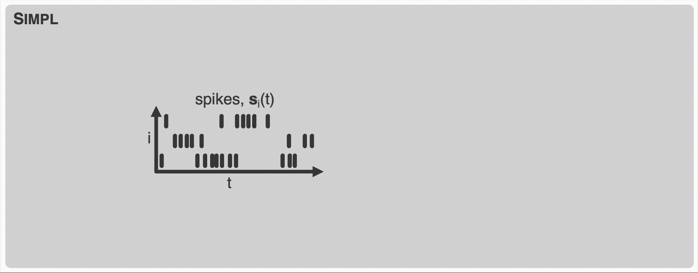

---

##### Download

+ [Paper](simpl.pdf)
+ [Code and data](https://anonymous.4open.science/r/simpl/README.md)

---

##### Abstract

High-dimensional neural activity in the brain is known to encode low-dimensional, time-evolving, behaviour-related variables. A fundamental goal of neural data analysis consists of identifying such variables and their mapping to neural activity. The canonical approach is to assume the latent variables are behaviour and visualize the subsequent tuning curves. However, significant mismatches between behaviour and the encoded variables may still exist --- the agent may be thinking of another location, or be uncertain of its own --- distorting the tuning curves and decreasing their interpretability. To address this issue a variety of methods have been proposed to learn this latent variable in an unsupervised manner; these techniques are typically expensive to train, come with many hyperparameters or scale poorly to large datasets complicating their adoption in practice. To solve these issues we propose SIMPL (Scalable Iterative Maximization of Population-coded Latents), an EM-style algorithm which iteratively optimizes latent variables and tuning curves. SIMPL is fast, scalable and exploits behaviour as an initial condition to further improve convergence and identifiability. We show SIMPL accurately recovers latent variables in biologically-inspired spatial and non-spatial tasks. When applied to a large rodent hippocampal dataset SIMPL efficiently finds a modified latent space with smaller, more numerous, and more uniformly-sized place fields than those based on behaviour, suggesting the brain may encode space with greater resolution than previously thought.

---

##### Citation

This paper is current unpublished and under review. Please check back later for the citation.

<!-- Unterholzer, Detlev A., and  Moritz-Maria von Igelfeld. 2013. "Unusual Uses For Olive Oil." *Journal of Oleic Science* 34 (1): 449–489. http://www.alexandermccallsmith.com/book/unusual-uses-for-olive-oil.

```BibTeX
@article{UI13,
author = {Detlev A. Unterholzer and Moritz-Maria von Igelfeld},
year = {2013},
title ={Unusual Uses For Olive Oil},
journal = {Journal of Oleic Science},
volume = {34},
number = {1},
pages = {449--489},
url = {http://www.alexandermccallsmith.com/book/unusual-uses-for-olive-oil}}
``` -->

---

##### Related material

+ [Cosyne abstract](cosyne.pdf)
